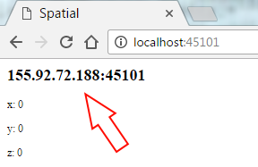
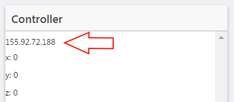

# Spatial-Client
A mobile controller that uses WebSockets to communicate with the Spatial game server.

<strong>Note:</strong> This is an Ionic App requires Node.js to be installed. Go to the [Node.js homepage](https://nodejs.org/en/) to download the latest version.

## Setup
Follow the command sequence to install and setup Ionic. First the Ionic package must be installed globally to add the platforms and build the project. 

```
$ npm install -g ionic
```

Install all the Node packages needed by the project.

```
$ npm install
```

Enable the desired platform. Use ```android``` for android devices and ```ios``` for iOS devices.<br>
<strong>Note:</strong> The iOS platform can only be enabled on a MacOS. 

```
$ ionic platform add android
```

Install the motion plugin that allows the app to read the device's orientation.

```
$ ionic plugin add cordova-plugin-device-motion
```

Plug in your device and run the following command to build and run the app. Again, use ```android``` for android devices and ```ios``` for iOS devices.

```
$ ionic run android
```

## Connecting
The client need to know the address of the game server. This can be found on the server page.



Enter the IP address into the input and you are good to go!

